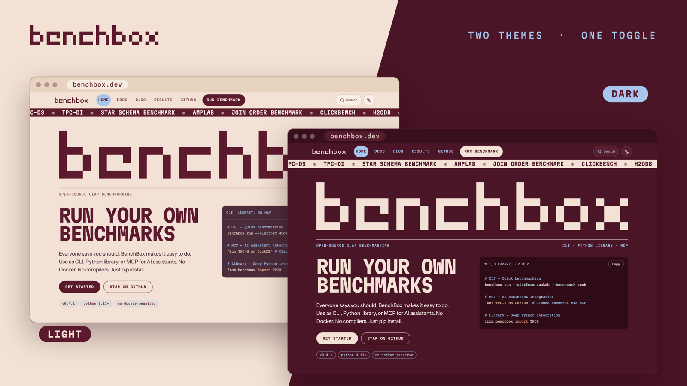
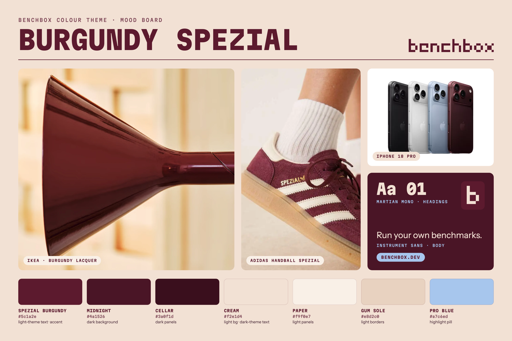
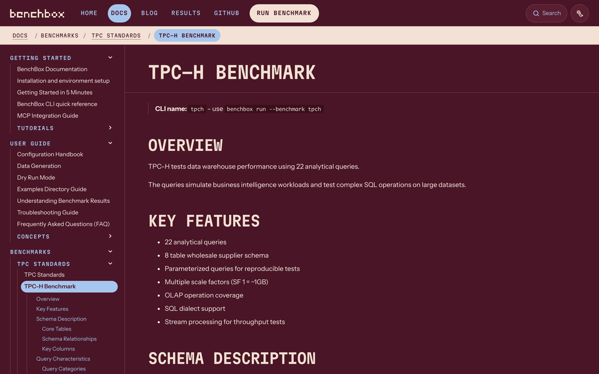

# A 'spezial' new look for the benchbox project

> `benchbox` has a new logo and updated burgundy color scheme inspired by a certain shoe

**TL;DR**: We updated the `benchbox` site with a new logo and a new look inspired by the Adidas Handball Spezial. The new design drops the generic templated look and provides clear and consistent navigation.

## Why redesign?

We added a new block-character wordmark for the project that is used in the CLI and source code. The site needed to be updated so that it was used consistently everywhere.

The previous site lacked any distinctive identity: it looked too much like a generic template. The new design is inspired by the new logo and improves the overall navigation so that it's easier to see where you are in the site.

The old site relied on the Sphinx static site engine and the Furo template theme. The new site drops all use of Python from the site infrastructure and moves to the more flexible Astro engine.

## Inspiration

The new burgundy and cream color scheme was mostly inspired by the Adidas Handball Spezial shoe. But, of course, the new iPhones use a similar palette and the most interesting new items from IKEA are also burgundy.

The palette has seven colors: three burgundies, three creams and tans, and one light blue. The blue is our only highlight color. It marks where you are: the current page, the current section, and the current tab in the header.

Headings use Martian Mono, a monospace font that echoes the terminal where `benchbox` runs. Body text uses Instrument Sans, so long pages stay easy to read.

## Light, dark and auto

This color palette has the very useful characteristic that it inverts cleanly, so we can easily create a light and dark theme for the site without diverging from the chosen colors. The light theme is burgundy text on cream. The dark theme is cream text on burgundy.

A single button next to search switches themes. It cycles through a sun (light), a moon (dark), and a sun and moon together (auto, which follows your system setting).

The old site sections were each styled to look similar but were in fact mostly separate implementations. The site now has a unified backend and the theme is cleanly and consistently applied to all sections. This includes the Results Explorer, where our charts and graphs have an updated look.

## Consistent navigation

The site now provides a consistent navigation style on all pages, with a sticky "breadcrumb" header so you can easily step back, and a clearly marked page and table of contents (TOC) position in the left-hand navigation bar. We also clarified and highlighted links to make them easy to spot and use.

Each part of the site uses the same pattern:

- **Docs**: the breadcrumb bar stays at the top as you scroll. On narrow screens, the middle steps collapse to "..." so the bar fits on one line.
- **Blog**: a new left nav lists all posts, an archive by year, the current post's sections, and the most-used tags.
- **Home page**: a sticky section nav shows which part of the page you are reading.

## Self-contained

The new design makes use of several nice open source fonts, but we are hosting these directly to minimize cross-site requests and tracking. Every page loads its fonts, styles, and scripts from benchbox.dev itself, with no calls to Google Fonts or other third-party servers.

## Try it

Visit [benchbox.dev](https://benchbox.dev/) and switch between the light and dark themes. If something looks wrong or is hard to read, [open an issue](https://github.com/BenchBox-dev/BenchBox/issues).

---

## References

1. [benchbox.dev](https://benchbox.dev/)
2. [Astro](https://astro.build/)
3. [Martian Mono](https://github.com/evilmartians/mono)
4. [Instrument Sans](https://github.com/Instrument/instrument-sans)
